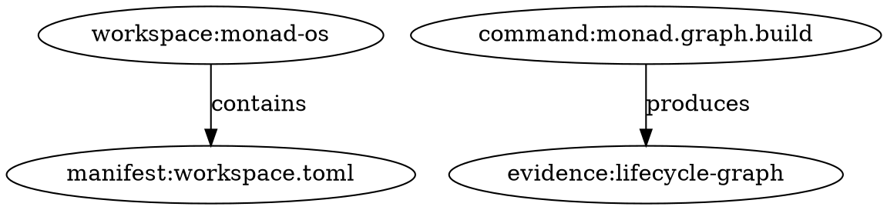
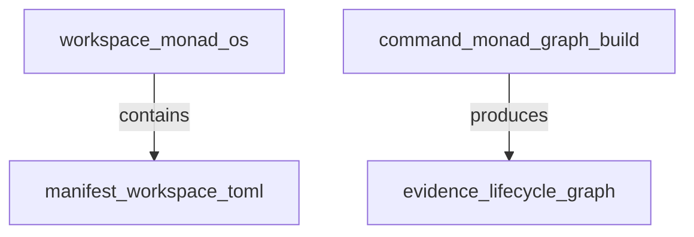

# Monad OS v0 Lifecycle Graph Schema

Status: Draft  
Stage: v0 implementation planning  
Owner: Monad OS maintainers  
Last updated: 2026-06-29

## Purpose

This document defines the initial lifecycle graph schema for Monad OS v0.

Monad OS turns a software organization’s code, docs, decisions, policies, tests, releases, incidents, infrastructure, and AI workflows into one governed, queryable, auditable lifecycle graph.

The v0 lifecycle graph schema defines the concrete graph artifact produced by:

```text
monad graph build
```

and consumed or exported by:

```text
monad graph export
monad evidence collect
monad context pack
monad report
```

## Scope

The v0 graph schema covers local repository artifacts only.

It should represent:

1. Workspace metadata.
2. Manifest metadata.
3. Documentation artifacts.
4. ADRs.
5. Implementation planning artifacts.
6. CLI command specifications.
7. Policy concepts.
8. Evidence concepts.
9. Context pack concepts.
10. Basic relationships between the above.

## Non-Goals

The v0 lifecycle graph does not attempt to model:

- Complete source-code ASTs.
- Complete package dependency graphs.
- Complete CI/CD execution history.
- Runtime service topology.
- Production incidents.
- Cloud infrastructure state.
- User accounts or RBAC.
- SaaS tenant state.
- Full OpenTelemetry traces.
- Full semantic embeddings.
- Full issue tracker state.
- Full pull request history.

Those belong to later v1 and v2 graph extensions.

## Design Principles

### 1. Deterministic

The same repository state should produce the same graph, ignoring timestamps unless explicitly requested.

### 2. Local-first

The graph must be buildable without a hosted backend.

### 3. Evidence-ready

The graph should be usable as an audit artifact.

### 4. AI-ready but AI-optional

The graph may help prepare AI context, but graph generation must not call an AI provider.

### 5. Append-friendly

Graph artifacts should be easy to diff, archive, and compare across commits.

### 6. Schema-versioned

The graph artifact must include a `graph_version`.

### 7. Portable

The graph schema must not assume a specific database, graph engine, or cloud service.

## Default Artifact Paths

The v0 CLI should use these paths by convention.

| Artifact | Path |
|---|---|
| JSON graph | `.monad/graph/lifecycle-graph.json` |
| Markdown graph report | `.monad/graph/lifecycle-graph.md` |
| DOT graph export | `.monad/graph/lifecycle-graph.dot` |
| Mermaid graph export | `.monad/graph/lifecycle-graph.mmd` |

Only JSON and Markdown are required for v0.

DOT and Mermaid are stretch outputs.

## Required v0 Graph Formats

| Format | Required for v0 | Purpose |
|---|---:|---|
| JSON | Yes | Machine-readable graph artifact |
| Markdown | Yes | Human-readable graph summary |
| DOT | No | Graphviz visualization |
| Mermaid | No | Documentation-native visualization |

## Top-Level JSON Shape

The v0 lifecycle graph JSON artifact should use this top-level shape.

```json
{
  "graph_version": "0.1",
  "id": "graph:lifecycle:monad-os",
  "workspace_id": "workspace:monad-os",
  "created_at": "2026-06-29T00:00:00Z",
  "source": {
    "root_path": ".",
    "manifest_path": "workspace.toml",
    "git": {
      "branch": "main",
      "commit": "unknown",
      "dirty": false
    }
  },
  "nodes": [],
  "edges": [],
  "summary": {
    "node_count": 0,
    "edge_count": 0,
    "node_types": {},
    "edge_types": {}
  },
  "warnings": []
}
```

## Top-Level Fields

| Field | Type | Required | Description |
|---|---|---:|---|
| `graph_version` | string | Yes | Graph schema version |
| `id` | string | Yes | Stable graph ID |
| `workspace_id` | string | Yes | Related workspace ID |
| `created_at` | string | Yes | Graph creation timestamp |
| `source` | object | Yes | Source repository metadata |
| `nodes` | array | Yes | Graph nodes |
| `edges` | array | Yes | Graph edges |
| `summary` | object | Yes | Graph summary |
| `warnings` | array | Yes | Non-fatal graph build warnings |

## Source Metadata

The `source` object records where the graph came from.

```json
{
  "root_path": ".",
  "manifest_path": "workspace.toml",
  "git": {
    "branch": "main",
    "commit": "unknown",
    "dirty": false
  }
}
```

### Source Fields

| Field | Type | Required | Description |
|---|---|---:|---|
| `root_path` | string | Yes | Workspace root path |
| `manifest_path` | string | Yes | Manifest path |
| `git` | object | Yes | Git metadata when available |

### Git Fields

| Field | Type | Required | Description |
|---|---|---:|---|
| `branch` | string or null | Yes | Current branch if available |
| `commit` | string or null | Yes | Current commit SHA if available |
| `dirty` | boolean or null | Yes | Whether working tree has uncommitted changes |

If Git metadata cannot be read, fields should be `null` rather than fabricated.

## GraphNode

A `GraphNode` is a typed vertex in the lifecycle graph.

### JSON Shape

```json
{
  "id": "adr:0001",
  "type": "adr",
  "label": "Build Monad OS as an SDLC Control Plane",
  "path": "docs/decisions/0001-build-monad-os-as-an-sdlc-control-plane.md",
  "properties": {
    "number": 1,
    "status": "accepted"
  }
}
```

### Required Fields

| Field | Type | Required | Description |
|---|---|---:|---|
| `id` | string | Yes | Stable node ID |
| `type` | string | Yes | Node type |
| `label` | string | Yes | Human-readable label |
| `path` | string or null | Yes | Repository-relative path if applicable |
| `properties` | object | Yes | Type-specific metadata |

## v0 Node Types

| Node Type | Required | Description |
|---|---:|---|
| `workspace` | Yes | Root workspace |
| `manifest` | Yes | `workspace.toml` |
| `document` | Yes | Documentation artifact |
| `adr` | Yes | Architecture Decision Record |
| `work_package` | Yes | Implementation work package |
| `command_spec` | Yes | Command specification document |
| `command` | Yes | CLI command described by the command spec |
| `policy` | Yes | Governance rule or policy concept |
| `script` | Yes | Local automation script |
| `evidence` | Yes | Evidence artifact or evidence concept |
| `context_pack` | Yes | Context pack artifact or concept |
| `roadmap` | Yes | Roadmap artifact |
| `directory` | Stretch | Top-level directory |
| `native_tool` | Stretch | Native tool detected or declared |
| `risk` | Stretch | Risk or known concern |

## Required Node Properties by Type

### `workspace`

```json
{
  "name": "monad-os",
  "root_path": "."
}
```

Required properties:

| Property | Type | Description |
|---|---|---|
| `name` | string | Workspace name |
| `root_path` | string | Workspace root path |

### `manifest`

```json
{
  "format": "toml",
  "schema_version": "0.1"
}
```

Required properties:

| Property | Type | Description |
|---|---|---|
| `format` | string | Manifest format |
| `schema_version` | string or null | Manifest schema version |

### `document`

```json
{
  "section": "architecture",
  "status": "draft"
}
```

Required properties:

| Property | Type | Description |
|---|---|---|
| `section` | string | Documentation section |
| `status` | string or null | Document status |

### `adr`

```json
{
  "number": 1,
  "status": "accepted"
}
```

Required properties:

| Property | Type | Description |
|---|---|---|
| `number` | integer | ADR number |
| `status` | string or null | ADR status |

### `work_package`

```json
{
  "phase": "v0",
  "status": "planned"
}
```

Required properties:

| Property | Type | Description |
|---|---|---|
| `phase` | string | Phase such as `v0`, `v1`, or `v2` |
| `status` | string or null | Work package status |

### `command_spec`

```json
{
  "version": "v0",
  "required_commands": 10
}
```

Required properties:

| Property | Type | Description |
|---|---|---|
| `version` | string | Command spec version |
| `required_commands` | integer or null | Count of required commands if known |

### `command`

```json
{
  "command": "monad doctor",
  "required": true,
  "mutates_files": false
}
```

Required properties:

| Property | Type | Description |
|---|---|---|
| `command` | string | Full command string |
| `required` | boolean | Whether required for v0 |
| `mutates_files` | boolean | Whether command may mutate files |

### `policy`

```json
{
  "category": "foundation",
  "severity": "error"
}
```

Required properties:

| Property | Type | Description |
|---|---|---|
| `category` | string | Policy category |
| `severity` | string | Policy severity |

### `script`

```json
{
  "executable": true
}
```

Required properties:

| Property | Type | Description |
|---|---|---|
| `executable` | boolean | Whether script is executable |

### `evidence`

```json
{
  "schema_version": "0.1",
  "generated": false
}
```

Required properties:

| Property | Type | Description |
|---|---|---|
| `schema_version` | string or null | Evidence schema version |
| `generated` | boolean | Whether evidence exists as a generated artifact |

### `context_pack`

```json
{
  "profile": "foundation",
  "generated": false
}
```

Required properties:

| Property | Type | Description |
|---|---|---|
| `profile` | string | Context pack profile |
| `generated` | boolean | Whether context pack exists as a generated artifact |

### `roadmap`

```json
{
  "phase_scope": ["v0", "v1", "v2"]
}
```

Required properties:

| Property | Type | Description |
|---|---|---|
| `phase_scope` | array | Roadmap phases covered |

## GraphEdge

A `GraphEdge` is a typed relationship between two graph nodes.

### JSON Shape

```json
{
  "id": "edge:workspace:monad-os:contains:adr:0001",
  "from": "workspace:monad-os",
  "to": "adr:0001",
  "type": "contains",
  "properties": {}
}
```

### Required Fields

| Field | Type | Required | Description |
|---|---|---:|---|
| `id` | string | Yes | Stable edge ID |
| `from` | string | Yes | Source node ID |
| `to` | string | Yes | Target node ID |
| `type` | string | Yes | Edge type |
| `properties` | object | Yes | Type-specific metadata |

## v0 Edge Types

| Edge Type | Required | Description |
|---|---:|---|
| `contains` | Yes | Parent contains child |
| `references` | Yes | Artifact references another artifact |
| `decides` | Yes | ADR decides or constrains an area |
| `implements` | Yes | Work package implements decision or capability |
| `validates` | Yes | Script or policy validates artifact |
| `produces` | Yes | Command produces artifact |
| `governs` | Yes | Policy governs artifact or action |
| `uses` | Yes | Command or artifact uses another artifact |
| `describes` | Yes | Document describes concept, command, or model |
| `requires_approval_for` | Yes | Approval gate guards risky action |
| `supersedes` | Stretch | ADR supersedes another ADR |
| `depends_on` | Stretch | Artifact depends on another artifact |
| `generated_from` | Stretch | Artifact generated from source artifact |

## Required Edge Properties by Type

### `contains`

```json
{
  "source": "filesystem"
}
```

### `references`

```json
{
  "source": "markdown-link",
  "confidence": "high"
}
```

### `decides`

```json
{
  "decision_scope": "cli"
}
```

### `implements`

```json
{
  "implementation_phase": "v0"
}
```

### `validates`

```json
{
  "validation_type": "foundation"
}
```

### `produces`

```json
{
  "artifact_kind": "evidence"
}
```

### `governs`

```json
{
  "governance_category": "safety"
}
```

### `uses`

```json
{
  "usage_type": "input"
}
```

### `describes`

```json
{
  "description_type": "specification"
}
```

### `requires_approval_for`

```json
{
  "risk_level": "high"
}
```

## ID Conventions

### Node IDs

Node IDs should use this format:

```text
<node-type>:<stable-key>
```

Examples:

| Node | ID |
|---|---|
| Workspace | `workspace:monad-os` |
| Manifest | `manifest:workspace.toml` |
| Root README | `document:README.md` |
| ADR 1 | `adr:0001` |
| v0 command spec | `command_spec:v0` |
| Doctor command | `command:monad.doctor` |
| Foundation check script | `script:scripts/check-foundation.sh` |
| Foundation policy | `policy:foundation.required-files` |
| Lifecycle graph | `evidence:lifecycle-graph` |
| Foundation context pack | `context_pack:foundation` |

### Edge IDs

Edge IDs should use this format:

```text
edge:<from>:<type>:<to>
```

Example:

```text
edge:workspace:monad-os:contains:adr:0001
```

Because node IDs may contain colons, implementations should not parse edge IDs by splitting on every colon. Edge IDs are stable labels, not the canonical edge data source.

The canonical relationship data is:

```json
{
  "from": "workspace:monad-os",
  "type": "contains",
  "to": "adr:0001"
}
```

## Required v0 Nodes for Current Foundation

The current repository foundation should produce at least these conceptual nodes.

### Workspace and Manifest

```text
workspace:monad-os
manifest:workspace.toml
```

### Root Documents

```text
document:README.md
document:AGENTS.md
document:docs/00-index.md
```

### Product Documents

```text
document:docs/product/charter.md
document:docs/product/prd.md
```

### Architecture Documents

```text
document:docs/architecture/technical-product-blueprint.md
document:docs/architecture/sdlc-control-plane.md
document:docs/architecture/toolchain-strategy.md
document:docs/architecture/agnosticity.md
document:docs/architecture/competitive-moat.md
```

### SDLC and Governance Documents

```text
document:docs/sdlc/full-sdlc-coverage.md
document:docs/governance/principles.md
```

### Strategy and Roadmap Documents

```text
document:docs/strategy/next-steps.md
roadmap:docs/roadmap/initial-implementation-sequence.md
roadmap:docs/roadmap/v0-v1-v2-roadmap.md
```

### Implementation Documents

```text
work_package:docs/implementation/v0-work-packages.md
command_spec:v0
document:docs/implementation/v0-data-model.md
document:docs/implementation/v0-lifecycle-graph-schema.md
```

### ADR Nodes

```text
adr:0001
adr:0002
adr:0003
adr:0004
adr:0005
adr:0006
adr:0007
adr:0008
adr:0009
adr:0010
adr:0011
adr:0012
adr:0013
adr:0014
adr:0015
```

### Script Nodes

```text
script:scripts/check-foundation.sh
```

### Required Command Nodes

```text
command:monad.help
command:monad.version
command:monad.init
command:monad.doctor
command:monad.workspace.inspect
command:monad.workspace.validate
command:monad.graph.build
command:monad.graph.export
command:monad.policy.check
command:monad.evidence.collect
command:monad.context.pack
```

### Required Policy Nodes

```text
policy:foundation.required-files
policy:foundation.required-directories
policy:foundation.adr-count
policy:foundation.adr-contiguous-numbering
policy:foundation.index-references
policy:safety.risky-ai-actions-require-approval
```

### Required Evidence and Context Nodes

```text
evidence:doctor
evidence:workspace-inspect
evidence:workspace-validate
evidence:policy-check
evidence:foundation-evidence
evidence:lifecycle-graph
context_pack:foundation
```

## Required v0 Edges for Current Foundation

The current repository foundation should produce at least these relationship categories.

### Workspace Contains Artifacts

```text
workspace:monad-os contains manifest:workspace.toml
workspace:monad-os contains document:README.md
workspace:monad-os contains document:AGENTS.md
workspace:monad-os contains document:docs/00-index.md
workspace:monad-os contains script:scripts/check-foundation.sh
```

### Workspace Contains ADRs

```text
workspace:monad-os contains adr:0001
workspace:monad-os contains adr:0002
...
workspace:monad-os contains adr:0015
```

### Index References Documents

```text
document:docs/00-index.md references document:docs/product/charter.md
document:docs/00-index.md references document:docs/product/prd.md
document:docs/00-index.md references command_spec:v0
document:docs/00-index.md references document:docs/implementation/v0-data-model.md
document:docs/00-index.md references document:docs/implementation/v0-lifecycle-graph-schema.md
```

### Command Spec Describes Commands

```text
command_spec:v0 describes command:monad.doctor
command_spec:v0 describes command:monad.graph.build
command_spec:v0 describes command:monad.policy.check
command_spec:v0 describes command:monad.evidence.collect
command_spec:v0 describes command:monad.context.pack
```

### Commands Produce Artifacts

```text
command:monad.doctor produces evidence:doctor
command:monad.workspace.inspect produces evidence:workspace-inspect
command:monad.workspace.validate produces evidence:workspace-validate
command:monad.policy.check produces evidence:policy-check
command:monad.evidence.collect produces evidence:foundation-evidence
command:monad.graph.build produces evidence:lifecycle-graph
command:monad.context.pack produces context_pack:foundation
```

### Policies Validate Artifacts

```text
policy:foundation.required-files validates workspace:monad-os
policy:foundation.required-directories validates workspace:monad-os
policy:foundation.adr-count validates workspace:monad-os
policy:foundation.adr-contiguous-numbering validates workspace:monad-os
policy:foundation.index-references validates document:docs/00-index.md
```

### Script Validates Foundation

```text
script:scripts/check-foundation.sh validates workspace:monad-os
script:scripts/check-foundation.sh validates document:docs/00-index.md
script:scripts/check-foundation.sh validates command_spec:v0
script:scripts/check-foundation.sh validates document:docs/implementation/v0-data-model.md
script:scripts/check-foundation.sh validates document:docs/implementation/v0-lifecycle-graph-schema.md
```

### ADRs Decide Product and Architecture Areas

```text
adr:0001 decides workspace:monad-os
adr:0002 decides command_spec:v0
adr:0003 decides manifest:workspace.toml
adr:0013 decides evidence:foundation-evidence
adr:0014 decides evidence:lifecycle-graph
adr:0015 governs command:monad.context.pack
```

## Graph Build Algorithm

The v0 graph builder should follow this deterministic order.

### Step 1: Resolve Workspace

1. Resolve workspace root.
2. Resolve manifest path.
3. Determine workspace name.
4. Create `workspace` node.
5. Create `manifest` node if `workspace.toml` exists.

### Step 2: Discover Files

1. Scan known foundation paths.
2. Scan `docs/` recursively for markdown files.
3. Scan `scripts/` for scripts.
4. Ignore `.git/`.
5. Ignore `.monad/cache/` and `.monad/tmp/`.
6. Treat missing required files as warnings rather than graph builder crashes.

### Step 3: Classify Artifacts

Classify each file into one of:

```text
manifest
document
adr
work_package
command_spec
roadmap
script
policy
evidence
context_pack
```

### Step 4: Extract Metadata

Extract lightweight metadata from known file types.

For Markdown documents:

1. First level-one heading as title.
2. `Status:` line if present.
3. `Stage:` line if present.
4. Section from path.

For ADRs:

1. ADR number from filename.
2. Title from first heading.
3. Status from `Status:` line if present.
4. Date from `Date:` line if present.

For scripts:

1. Executable bit.
2. File path.
3. Script extension.

For command specs:

1. Command names from command inventory.
2. Required vs stretch status where possible.
3. Artifact outputs where documented.

### Step 5: Create Nodes

1. Create workspace node first.
2. Create manifest node second.
3. Create document nodes sorted by path.
4. Create ADR nodes sorted by ADR number.
5. Create command nodes sorted by command path.
6. Create policy nodes sorted by ID.
7. Create evidence and context nodes sorted by ID.

### Step 6: Create Edges

1. Create `contains` edges.
2. Create `references` edges from markdown links.
3. Create `describes` edges from spec documents.
4. Create `produces` edges from command-to-artifact mapping.
5. Create `validates` edges from policy and script rules.
6. Create `decides` edges from ADR mappings.
7. Create `governs` edges from policy and approval rules.

### Step 7: Validate Graph

1. Every edge `from` node must exist.
2. Every edge `to` node must exist.
3. Node IDs must be unique.
4. Edge IDs must be unique.
5. Required node types must be present.
6. Required edge types must be present.
7. Summary counts must match actual arrays.

### Step 8: Write Artifact

1. Write JSON artifact to `.monad/graph/lifecycle-graph.json`.
2. Optionally write Markdown summary to `.monad/graph/lifecycle-graph.md`.
3. Return text summary to terminal.

## Markdown Link Extraction

The v0 graph builder should extract simple Markdown links.

Supported pattern:

```text
[Label](relative/path.md)
```

Rules:

1. Only repository-relative links should create graph edges.
2. External URLs should be ignored or recorded as warnings.
3. Anchor links may be ignored in v0.
4. Broken internal links should create warnings.
5. Links should create `references` edges.

## Command Extraction

The v0 graph builder should extract command nodes from `docs/implementation/v0-command-spec.md`.

Minimum commands:

```text
monad help
monad version
monad init
monad doctor
monad workspace inspect
monad workspace validate
monad graph build
monad graph export
monad policy check
monad evidence collect
monad context pack
```

Command IDs should replace spaces with dots after the `monad` prefix.

Example:

```text
monad workspace inspect -> command:monad.workspace.inspect
```

## ADR Extraction

ADR files should be discovered from:

```text
docs/decisions/[0-9][0-9][0-9][0-9]-*.md
```

ADR IDs should use the four-digit number.

Example:

```text
docs/decisions/0001-build-monad-os-as-an-sdlc-control-plane.md -> adr:0001
```

## Policy Extraction

In v0, policy nodes may be hardcoded as built-in foundation policies.

Later versions may load policies from policy packs.

Required v0 built-in policies:

| Policy ID | Purpose |
|---|---|
| `policy:foundation.required-files` | Required files exist |
| `policy:foundation.required-directories` | Required directories exist |
| `policy:foundation.adr-count` | Expected ADR count exists |
| `policy:foundation.adr-contiguous-numbering` | ADR numbers are contiguous |
| `policy:foundation.index-references` | Documentation index references required files |
| `policy:safety.risky-ai-actions-require-approval` | Risky AI actions require human approval |

## Evidence Extraction

Evidence nodes may represent expected outputs even before those outputs exist.

Example:

```json
{
  "id": "evidence:doctor",
  "type": "evidence",
  "label": "Doctor Evidence",
  "path": ".monad/evidence/doctor.json",
  "properties": {
    "schema_version": "0.1",
    "generated": false
  }
}
```

Once evidence files exist, `generated` should become `true`.

## Context Pack Extraction

Context pack nodes may represent expected outputs even before those outputs exist.

Example:

```json
{
  "id": "context_pack:foundation",
  "type": "context_pack",
  "label": "Foundation Context Pack",
  "path": ".monad/context/foundation.md",
  "properties": {
    "profile": "foundation",
    "generated": false
  }
}
```

## Summary Object

The graph summary should contain counts.

```json
{
  "node_count": 42,
  "edge_count": 64,
  "node_types": {
    "workspace": 1,
    "manifest": 1,
    "document": 10,
    "adr": 15
  },
  "edge_types": {
    "contains": 30,
    "references": 20,
    "produces": 8
  }
}
```

## Warning Object

Warnings should use this shape.

```json
{
  "id": "warning:broken-reference:docs/00-index.md:missing.md",
  "severity": "warning",
  "message": "Markdown link points to a missing file.",
  "path": "docs/00-index.md"
}
```

### Warning Fields

| Field | Type | Required | Description |
|---|---|---:|---|
| `id` | string | Yes | Warning ID |
| `severity` | string | Yes | Warning severity |
| `message` | string | Yes | Human-readable warning |
| `path` | string or null | Yes | Related file path |

## Validation Rules

A v0 lifecycle graph is valid when:

1. `graph_version` exists.
2. `id` exists.
3. `workspace_id` exists.
4. `source` exists.
5. `nodes` is an array.
6. `edges` is an array.
7. `summary` exists.
8. Every node has `id`, `type`, `label`, `path`, and `properties`.
9. Every edge has `id`, `from`, `to`, `type`, and `properties`.
10. Node IDs are unique.
11. Edge IDs are unique.
12. Every edge source node exists.
13. Every edge target node exists.
14. Required node types are present.
15. Required edge types are present.
16. Summary counts match actual graph content.

## Deterministic Ordering

To keep graph diffs stable:

1. Sort nodes by `type`, then `id`.
2. Sort edges by `type`, then `from`, then `to`.
3. Sort object keys when writing JSON if the serializer supports it.
4. Avoid embedding nondeterministic paths.
5. Keep timestamps only at the top-level graph metadata.

## Hashing

The v0 graph may include content hashes as optional node properties.

Recommended format:

```text
sha256:<hex>
```

Hashing is optional for the first implementation.

When implemented, hash only file contents, not absolute paths or timestamps.

## Privacy and Safety

The graph builder should avoid collecting secrets.

The v0 graph builder should:

1. Ignore `.env` files.
2. Ignore private key files.
3. Ignore `.git/`.
4. Ignore dependency directories such as `node_modules/`.
5. Ignore local cache directories.
6. Avoid storing full file contents in graph nodes.
7. Store paths and metadata rather than raw source content.

## Git Ignore Recommendation

Generated graph artifacts under `.monad/` should generally remain local generated state unless intentionally committed as evidence.

A later ADR should decide whether selected `.monad/evidence/` and `.monad/graph/` artifacts are committed.

## Example Minimal Graph

```json
{
  "graph_version": "0.1",
  "id": "graph:lifecycle:monad-os",
  "workspace_id": "workspace:monad-os",
  "created_at": "2026-06-29T00:00:00Z",
  "source": {
    "root_path": ".",
    "manifest_path": "workspace.toml",
    "git": {
      "branch": "main",
      "commit": "unknown",
      "dirty": false
    }
  },
  "nodes": [
    {
      "id": "workspace:monad-os",
      "type": "workspace",
      "label": "monad-os",
      "path": ".",
      "properties": {
        "name": "monad-os",
        "root_path": "."
      }
    },
    {
      "id": "manifest:workspace.toml",
      "type": "manifest",
      "label": "workspace.toml",
      "path": "workspace.toml",
      "properties": {
        "format": "toml",
        "schema_version": "0.1"
      }
    },
    {
      "id": "command:monad.graph.build",
      "type": "command",
      "label": "monad graph build",
      "path": "docs/implementation/v0-command-spec.md",
      "properties": {
        "command": "monad graph build",
        "required": true,
        "mutates_files": true
      }
    },
    {
      "id": "evidence:lifecycle-graph",
      "type": "evidence",
      "label": "Lifecycle Graph",
      "path": ".monad/graph/lifecycle-graph.json",
      "properties": {
        "schema_version": "0.1",
        "generated": true
      }
    }
  ],
  "edges": [
    {
      "id": "edge:workspace:monad-os:contains:manifest:workspace.toml",
      "from": "workspace:monad-os",
      "to": "manifest:workspace.toml",
      "type": "contains",
      "properties": {
        "source": "filesystem"
      }
    },
    {
      "id": "edge:command:monad.graph.build:produces:evidence:lifecycle-graph",
      "from": "command:monad.graph.build",
      "to": "evidence:lifecycle-graph",
      "type": "produces",
      "properties": {
        "artifact_kind": "graph"
      }
    }
  ],
  "summary": {
    "node_count": 4,
    "edge_count": 2,
    "node_types": {
      "workspace": 1,
      "manifest": 1,
      "command": 1,
      "evidence": 1
    },
    "edge_types": {
      "contains": 1,
      "produces": 1
    }
  },
  "warnings": []
}
```

## Markdown Export Shape

The Markdown export should be human-readable and reviewable.

Recommended sections:

```text
# Monad OS Lifecycle Graph

## Summary
## Source
## Node Counts
## Edge Counts
## Nodes
## Edges
## Warnings
```

### Example Markdown Summary

```markdown
# Monad OS Lifecycle Graph

Graph version: 0.1  
Workspace: workspace:monad-os  
Nodes: 42  
Edges: 64  

## Node Counts

| Type | Count |
|---|---:|
| adr | 15 |
| document | 12 |
| command | 11 |

## Edge Counts

| Type | Count |
|---|---:|
| contains | 30 |
| references | 20 |
| produces | 8 |
```

## DOT Export Shape

DOT export is a stretch goal.

Example:



## Mermaid Export Shape

Mermaid export is a stretch goal.

Example:



## Relationship to v0 Data Model

The lifecycle graph schema specializes the v0 data model.

| Data Model Entity | Graph Representation |
|---|---|
| `Workspace` | `workspace` node |
| `Manifest` | `manifest` node |
| `Artifact` | Typed node by artifact kind |
| `Document` | `document` node |
| `ADR` | `adr` node |
| `WorkPackage` | `work_package` node |
| `CommandSpec` | `command_spec` node |
| `Policy` | `policy` node |
| `EvidenceBundle` | `evidence` node |
| `ContextPack` | `context_pack` node |
| `ApprovalGate` | `policy` node or future `approval_gate` node |

## Relationship to ADRs

| ADR | Graph Relevance |
|---|---|
| ADR-0001 | Establishes lifecycle graph as part of the SDLC control plane |
| ADR-0002 | CLI is the local graph builder interface |
| ADR-0003 | `workspace.toml` is a graph input |
| ADR-0004 | Native tools may become graph inputs |
| ADR-0006 | Graph must remain AI, cloud, and database agnostic |
| ADR-0009 | Graph must work without SaaS |
| ADR-0010 | Graph can later synchronize to hosted SaaS |
| ADR-0011 | Policies become graph nodes |
| ADR-0012 | Packs and plugins may extend graph extraction |
| ADR-0013 | Evidence becomes graph nodes and outputs |
| ADR-0014 | Lifecycle graph is the core product moat |
| ADR-0015 | Risky AI actions require approval gates in the graph |

## Implementation Notes for Rust

Recommended Rust module names:

```text
crates/monad-core/src/graph/mod.rs
crates/monad-core/src/graph/model.rs
crates/monad-core/src/graph/build.rs
crates/monad-core/src/graph/export.rs
crates/monad-core/src/graph/validate.rs
```

Recommended Rust data structures:

```text
LifecycleGraph
GraphSource
GraphGitSource
GraphNode
GraphEdge
GraphSummary
GraphWarning
NodeType
EdgeType
```

Recommended crates:

| Need | Candidate Crate |
|---|---|
| Serialization | `serde` |
| JSON | `serde_json` |
| TOML manifest parsing | `toml` |
| Time | `time` or `chrono` |
| Walking directories | `walkdir` |
| Git metadata | shell out to `git` first, consider `gix` later |
| Hashing | `sha2` |

The first implementation should avoid unnecessary complexity and can shell out to Git for basic metadata.

## Open Questions

1. Should v0 graph artifacts include timestamps by default, even though they make diffs less stable?
2. Should graph build fail on broken internal Markdown links or only warn?
3. Should expected but missing evidence artifacts appear as graph nodes?
4. Should policy nodes be hardcoded in v0 or loaded from a built-in policy manifest?
5. Should `.monad/graph/lifecycle-graph.json` be committed as an example artifact?
6. Should graph exports include absolute paths, repository-relative paths, or both?
7. Should graph schema be formalized as JSON Schema in v0?
8. Should command extraction use parsing rules or a manually maintained command registry first?

## Acceptance Criteria

The v0 lifecycle graph schema is acceptable when:

1. It defines a top-level graph JSON shape.
2. It defines `GraphNode`.
3. It defines `GraphEdge`.
4. It defines required node types.
5. It defines required edge types.
6. It defines ID conventions.
7. It defines source metadata.
8. It defines warning metadata.
9. It defines validation rules.
10. It defines deterministic ordering.
11. It defines expected graph outputs.
12. It maps to the v0 data model.
13. It supports the v0 command specification.
14. It remains local-first.
15. It remains AI, cloud, and database agnostic.

## Summary

The v0 lifecycle graph schema turns the Monad OS foundation from a set of documents into a structured graph contract.

The first graph does not need to be large or deeply semantic.

It needs to be:

```text
local
deterministic
typed
auditable
queryable
extensible
```

That is enough to establish the core Monad OS product moat and create the foundation for future graph-backed governance, evidence, context engineering, and hosted control-plane capabilities.
